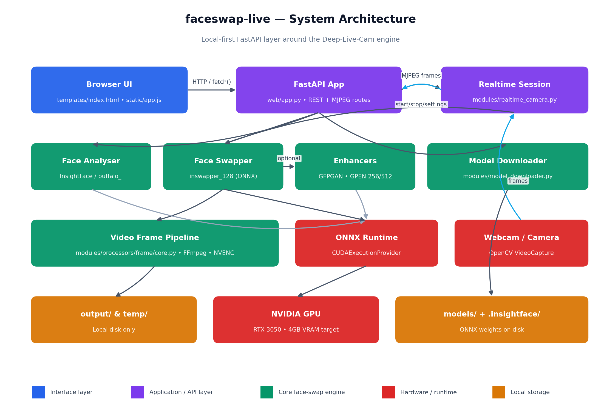
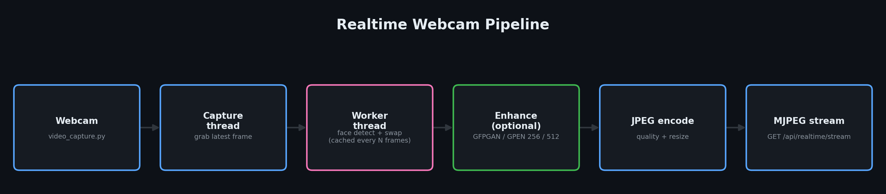
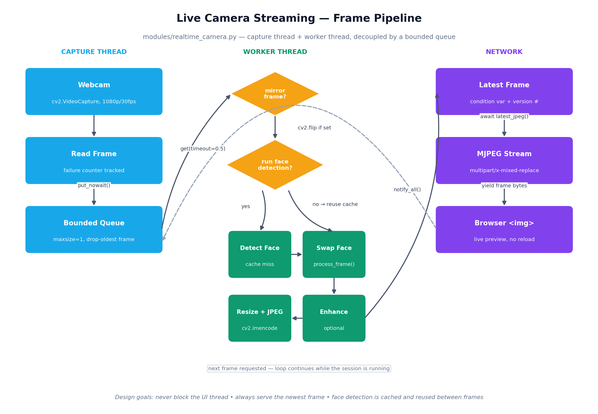

<div align="center">

# faceswap-live

**A local, private, browser-based control panel for [Deep-Live-Cam](https://github.com/hacksider/Deep-Live-Cam) —
image swap, video swap, and real-time webcam face swapping, running entirely on your own GPU.**

[](LICENSE)
[](https://github.com/Amaan9136/faceswap-live/issues)
[](https://github.com/Amaan9136/faceswap-live/stargazers)
[](CONTRIBUTING.md)
[](CODE_OF_CONDUCT.md)
[](https://github.com/sponsors/Amaan9136)

[Quick start](#-quick-start) · [Features](#-features) · [Architecture](#-architecture) · [API](#-api-overview) · [Contributing](#-contributing) · [License](#-license)

</div>

---

## Why this project exists

[Deep-Live-Cam](https://github.com/hacksider/Deep-Live-Cam) is a powerful real-time face-swap engine, but it's
built around a desktop GUI and a Python entrypoint. **[faceswap-live](https://github.com/Amaan9136/faceswap-live) wraps that engine in a FastAPI web app**, so
you can drive it from any browser on your own machine — no Docker, no cloud upload, no account. You open a tab,
pick a source face, and go.

This repo does **not** reimplement the face-swap engine. It reuses Deep-Live-Cam's face analyser, face swapper,
enhancers, and video pipeline as-is, and adds:

- A clean browser UI for image/video swap **and** real-time webcam streaming
- A JSON API around all of it, so it's scriptable
- GPU-aware defaults tuned to run on modest hardware (developed against an RTX 3050, 4 GB VRAM)
- Zero external services — everything reads and writes to your local disk

## 📐 Architecture



The browser talks to a single FastAPI process (`web/app.py`), which either runs a background image/video job
through `modules/core.py`, or hands the webcam off to a dedicated `realtime_camera.py` capture + worker thread
pair. Both paths converge on the same underlying Deep-Live-Cam modules: `face_analyser.py`, the
`face_swapper` / `face_enhancer` frame processors, and `gpu_processing.py` for execution-provider selection.

### Real-time streaming pipeline





The realtime path is built to stay responsive on limited VRAM: face detection is cached every `detect_every`
frames instead of run on every frame, and frames are **dropped rather than queued** whenever a downstream step
(swap, enhance, encode) falls behind, so the live preview never lags noticeably behind the webcam.

## ✨ Features

| | |
|---|---|
| 🖼️ **Image → Image swap** | Swap a face from a source photo onto a target photo in one request. |
| 🎬 **Image → Video swap** | Face-swap an entire video, frame by frame, with FPS/audio/resolution preserved via FFmpeg. |
| 📹 **Real-time webcam swap** | Deep-Live-Cam's signature live mode, streamed to the browser as MJPEG — no external app needed. |
| 🎚️ **Live-tunable settings** | Mirroring, stream width, JPEG quality, capture resolution/FPS, and detection interval adjustable mid-stream. |
| ✨ **Multiple enhancers** | Optional GFPGAN, GPEN-256, or GPEN-512 face enhancement, toggled per session. |
| 🎭 **Fine-grained blending** | Opacity, sharpness, Poisson blending, color correction, and mouth-area masking controls. |
| 👥 **Many-faces / face mapping** | Swap every detected face, or map specific source→target faces individually. |
| ⚡ **GPU-first, CPU-safe** | Prefers `CUDAExecutionProvider` when available and falls back to CPU automatically. |
| 📦 **Model manager** | Download, list, and delete the ONNX models the app needs, right from the UI. |
| 🔒 **100% local** | No cloud calls, no database, no login. Files never leave your machine. |

## 🚀 Quick start

```bash
git clone https://github.com/Amaan9136/faceswap-live.git
cd faceswap-live
python -m venv .venv
source .venv/bin/activate        # Windows: .venv\Scripts\activate
pip install -r requirements.txt
python run_web.py
```

Then open **http://127.0.0.1:8000**.

On Windows, you can instead use the bundled helper (it will clone the upstream Deep-Live-Cam repo automatically
if it isn't present yet):

```powershell
& .\start_web.ps1
```

**GPU users:** install the CUDA build of ONNX Runtime for your platform (see `requirements.txt`) so the server
can pick up `CUDAExecutionProvider`. Everything still works on CPU — it's just slower for video and realtime.

## 🧭 Using it

1. **Image / Video tab** — upload a source face and a target image or video, tune options (enhancer, opacity,
   many-faces, etc.), and submit. Track progress and download the result when it's done.
2. **Real-Time Camera tab** — pick a webcam, upload/select a source face, hit start, and adjust settings live
   while the MJPEG preview streams in the browser.
3. **Models panel** — see which ONNX models are present, download missing ones, or free up disk space.

## 🔌 API overview

All endpoints are local to the running server (`http://127.0.0.1:8000` by default):

| Method | Path | Purpose |
|---|---|---|
| `GET`  | `/api/providers` | List available ONNX Runtime execution providers (CPU/CUDA) |
| `GET`  | `/api/system` | Runtime/GPU/provider info |
| `GET`  | `/api/models` | List known models and their status |
| `POST` | `/api/models/download` | Download one or more models |
| `DELETE` | `/api/models/{name}` | Delete a downloaded model |
| `POST` | `/api/swap` | Start an image/video swap job |
| `GET`  | `/api/jobs/{job_id}` | Poll job status/progress |
| `GET`  | `/api/jobs/{job_id}/result` | Fetch/download the finished output |
| `GET`  | `/api/outputs` | List generated files |
| `GET`  | `/api/outputs/{name}` | Fetch/download a specific generated file |
| `DELETE` | `/api/outputs/{name}` | Delete a generated file |
| `GET`  | `/api/realtime/cameras` | List available webcams |
| `POST` | `/api/realtime/source` | Upload/select the realtime source face |
| `POST` | `/api/realtime/start` | Start a realtime session |
| `POST` | `/api/realtime/settings` | Adjust realtime options while streaming |
| `GET`  | `/api/realtime/status` | Get current realtime session status |
| `GET`  | `/api/realtime/stream` | The live MJPEG stream |
| `POST` | `/api/realtime/stop` | Stop the realtime session |

## 🗂️ Project layout

```
web/                    FastAPI app, templates, static assets (the layer this repo adds)
modules/                Reused Deep-Live-Cam engine: face analysis, swapping, enhancing, GPU selection
modules/processors/     Frame processors (swapper, enhancers, masking) run per-frame/per-image
run_web.py              Entrypoint — starts uvicorn against web.app:app
start_web.ps1           Windows helper: clones Deep-Live-Cam if missing, then launches the server
docs/assets/            Architecture diagrams + the script that generates them
```

## 🩹 Responsible use

This project performs face swapping, including real-time webcam face swapping. It is intended for creative,
educational, and research use. Using it to impersonate real individuals without consent, to harass, defame, or
deceive, or to create non-consensual intimate imagery is strictly outside its intended and supported use — see
[SECURITY.md](SECURITY.md#responsible-use) and upstream Deep-Live-Cam's own usage guidelines, which this project
follows as well.

## 🤝 Contributing

Contributions of all sizes are welcome — bug fixes, docs, new enhancer backends, UI polish, or just filing a
well-written issue.

- Read [CONTRIBUTING.md](CONTRIBUTING.md) for the full workflow (setup, branch naming, testing, PR process).
- Please follow the [Code of Conduct](CODE_OF_CONDUCT.md).
- Found a security issue? See [SECURITY.md](SECURITY.md) — please don't file it as a public issue.
- Not sure where to start? Check [open issues](https://github.com/Amaan9136/faceswap-live/issues) or open a
  [discussion](https://github.com/Amaan9136/faceswap-live/discussions).

### Contributors

<a href="https://github.com/Amaan9136/faceswap-live/graphs/contributors">
  
</a>

*Made with [contrib.rocks](https://contrib.rocks) — this updates automatically as people contribute.*

## 💛 Support this project

If faceswap-live is useful to you, consider
[sponsoring on GitHub](https://github.com/sponsors/Amaan9136) or starring the repo — it helps others find it.

## 🙏 Acknowledgements

- [Deep-Live-Cam](https://github.com/hacksider/Deep-Live-Cam) by [@hacksider](https://github.com/hacksider) and
  contributors — the face-swap engine this project builds a web layer around.
- [InsightFace](https://github.com/deepinsight/insightface), [ONNX Runtime](https://onnxruntime.ai/), and
  [FastAPI](https://fastapi.tiangolo.com/), which power the core pipeline and web layer respectively.

## 📄 License

Licensed under the **GNU Affero General Public License v3.0** — see [LICENSE](LICENSE) for the full text.
AGPL-3.0 was chosen to match the upstream Deep-Live-Cam project, so any modified version of this app that's
made available over a network must also make its source available.
